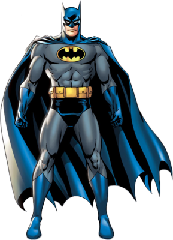

    

    

### Hi there 👋
🔭 I’m currently working as a Machine Learning Engineer Trainee  
🌱 I’m currently working on Knowledge Graphs  
👯 I’m looking to collaborate on ML and DL with realworld usecase.  
📫 How to reach me: mustaffahussain4734@gmail.com 
🔨 Portfolio link: https://mustaffa-hussain.github.io/Portfolio/  
💬 I have Medium Publication @theCyPhy.[ https://medium.com/thecyphy ]We write about ML,DL and other tech changes in the world. Drop message to contribute 
⚡ Fun fact: Stuck with something, have a donut. 

<!--
**mustaffa-hussain/mustaffa-hussain** is a ✨ _special_ ✨ repository because its `README.md` (this file) appears on your GitHub profile.

Here are some ideas to get you started:

- 🔭 I’m currently working on ...
- 🌱 I’m currently learning ...
- 👯 I’m looking to collaborate on ...
- 🤔 I’m looking for help with ...
- 💬 Ask me about ...
- 📫 How to reach me: ...
- 😄 Pronouns: ...
- ⚡ Fun fact: ...
-->
